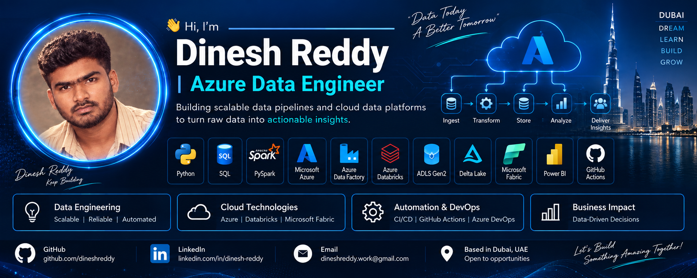

<div align="center">

# 👋 Hi, I'm Dinesh Reddy

## Azure Data Engineer

### Building scalable data pipelines and cloud data platforms
### that turn raw data into actionable insights.



</div>

---

## 🚀 About Me

I'm an Azure Data Engineer focused on building scalable,
reliable and automated data platforms.

- ☁️ Microsoft Azure
- 🔷 Azure Data Factory
- 🧱 Azure Databricks
- ⚡ PySpark
- 🐍 Python
- 🗄️ SQL
- 💾 ADLS Gen2
- 🔺 Delta Lake
- 🏭 Microsoft Fabric
- 📊 Power BI
- 🔄 GitHub Actions / Azure DevOps

---

## 🛠️ Tech Stack

| Category | Technologies |
|---|---|
| Cloud | Microsoft Azure |
| Data Engineering | ADF, Databricks, Synapse |
| Big Data | Apache Spark, PySpark |
| Storage | ADLS Gen2, Delta Lake |
| Programming | Python, SQL |
| Analytics | Power BI, Microsoft Fabric |
| DevOps | GitHub Actions, Azure DevOps |
| Architecture | Medallion Architecture |
| Data Processing | ETL / ELT, Batch Processing |

---

## 📂 Featured Projects

### 🔹 Azure Data Engineering Pipeline
End-to-end data pipeline using Azure Data Factory,
ADLS Gen2, Databricks, PySpark and Delta Lake.

### 🔹 Databricks Medallion Architecture
Bronze → Silver → Gold architecture using
PySpark and Delta Lake.

### 🔹 Microsoft Fabric Data Platform
Data ingestion, transformation and analytics using
Microsoft Fabric.

### 🔹 Metadata-Driven ADF Framework
Reusable metadata-driven pipelines for scalable
data ingestion and transformation.

### 🔹 Data Quality Framework
Data validation, logging, monitoring and
pipeline quality checks.

---

## 🏗️ Data Engineering Architecture

```text
Source Systems
      │
      ▼
Azure Data Factory
      │
      ▼
ADLS Gen2 - Bronze
      │
      ▼
Azure Databricks
      │
      ▼
Delta Lake - Silver
      │
      ▼
Gold / Business Layer
      │
      ▼
Power BI / Analytics
